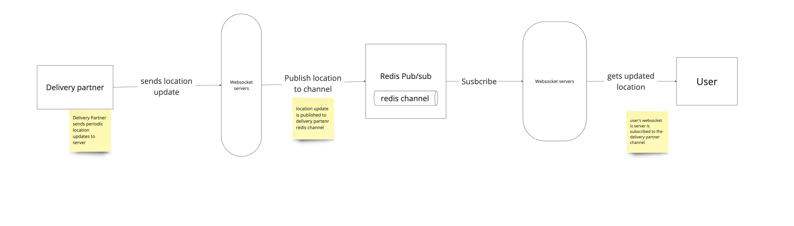

## Requirements
- we need location based service to locate nearby restaurants from which order can be placed
- we need real time location updates of delivery guys to find who is nearby to restaurant.
- once delivery guy is assigned. We need a real time location communication between client and deliver guy

### location based service: refer proximity service notes.
/img_1.png)
- onboard a new place, add its lat/long in redis and mongoDB
- based on user lat/long do a geoSpacial query over redis

### assigning delivery guy

- delivery guys periodic locations are stored in location cache. he can be connected to a websocket. Polling can be implemented incase of fallback(websocket connection breaks)
- we can have a HearBeat mechanism to check if websocket is connected to delivery partner. If websocket is disconnected we can evict the delivery guy last location from cache as it is now stale.
- from the cafe where order is placed. We do a search on the location cache(again will use redis as it supports geoSpaial searches). to find the closest delivery partner.
- req send to delivery guy to accept the delivery or not.

### delivery guy is assigned

- we connect customer to a websocket server, which is subscribed to delivery partner's redis channel. 
- delivery partner will periodically send there location to websocket. Websocket publish message to its redis channel. Customer gets location update its websocket server has subscribed to its channel

