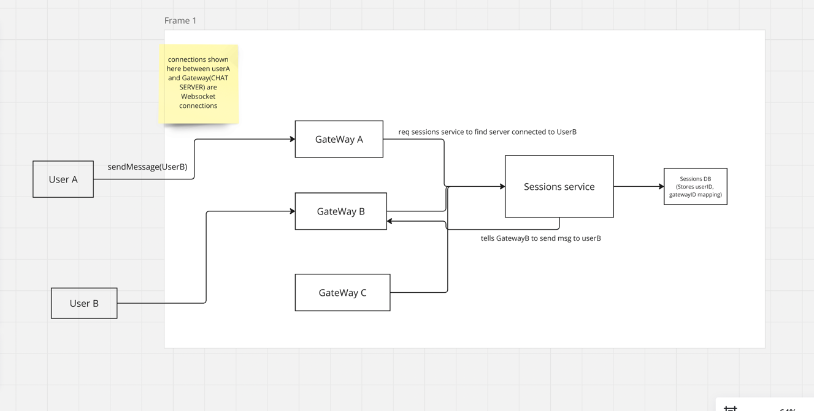
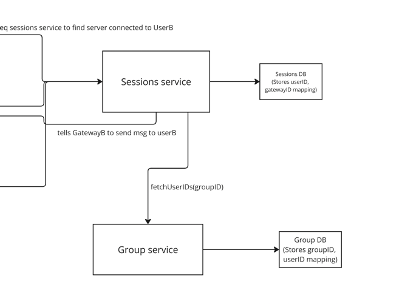

## Functional Requirements
ASK interviewers which features to include from these.
- Group messaging
- Sent + delivered + read receipts
- online/last seen
- image sharing (handling images is covered in tinder design)
- chats are temporary/Permanent
- 1-1 chat (basic and most important)

## 1-1 chat

for 1-1 chat we need to establish some sort of connection between the 2 users. Http cant be used here as it is a client-server protocol. We need a peer-to-peer connection so will use WebSockets.

UserA will establish a connection with an instance of Gateway service(CHAT SERVER). Simillary UserB will do that too. When a user forms a connection to chat server this mapping stored in sessions DB and sessions service provide this mapping whenever we need

So when userA sends a msg req for userB to chat server. Chat server req sessions service to route the req to chat server connected to userB.

 

### How websocket connection is established between client and chat server
- user makes a request, It goes to a API Gateway. The API Gateway does authentication(based on token, or password). and finds a suitable chat server and sends its connection info back to userA, so that userA can initiate a websocket connection request. Chat server after getting req sends back an ack is to user and a websocket connection is created. This info is mapped by session service in session db.

- The responsibility of finding a suitable chat server can be delegated to a **Service Discovery**(Eg, Apache Zookeeper). The Zookeeper dynamically registers any new chat servers added. Monitor health and load on servers and can take intelligent decision.

## Sent + delivered + read receipts

- When userA sends req and chat server A gets it, it sends an ACK back to user A. This marks that message is SENT.

- Once Chat server sends message to userB, UserB sends a ack. This marks the message to be DELIVERED.

- Once userB opens its app and the chat tab os userA. It sends a signal to chat server that message is READ. This communication is routed to userA and it received a read ack.

## Online/last seen

- We can have a LastSeen service that updates entry in a UserActivity DB whenever user makes an req to servers. The DB stores userID->last active TimeStamp.

- Whenever user sends req to chat server, chat server makes a req to LastSeen service to update the timestamp.

- Now when a userB req the last seen of userA, the req goes to LastSeen service and the timestamp is returns after fecthing it from DB

## Group messaging
- We will introduce a Group service that maintains a GroupDB(stores mapping of groupID->userID). 
- Sessions service when receives req for a group message it delegates it to group service which retrives the userID of all the users present in group.
- Once all the userIDs are known, Sessions service sends message to the respective chat servers. Here to avoid a fan-out issue chat apps usually limit number of users in a group chat, otherwise the load will be drastice on the sessions service incase of group messages
- We will use **noSQL DB with partition key as groupID** for group DB so that it can scale well. Also the group service will be sharded via **consistent hashing** with the hash on groupID

## Handle retry and user offline scenarios

- We can introduce **message queues**, which stores the messages to be sent to user. Once user is online the message from queue goes to user. User is online or not can be found via **LastSeen service**.
- We can add a **notification system** which send notifications if user is offline as per LastSeen service. Once user is back online, Last Seen service signal the queue to send the message

