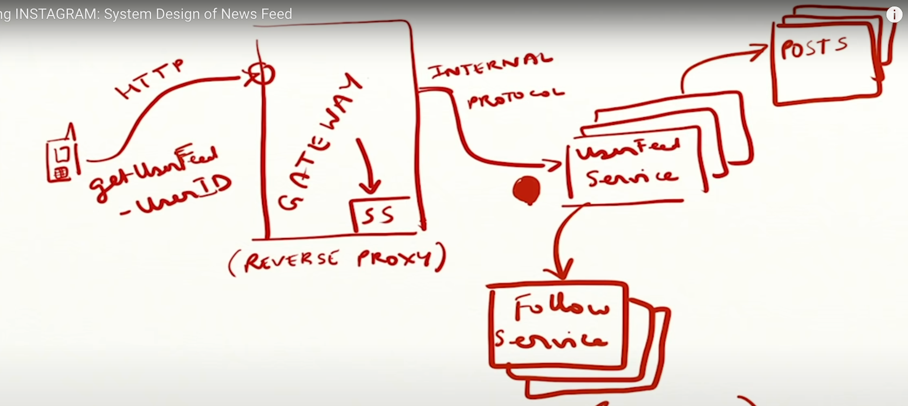

## Requirements
1. Store/get images
2. like+comment on Images
3. follow someone
4. Publish news feed

**Store/Get Images covered in designing Tinder notes**

Assume you can like a post and comment as well. Assume you can just comment, not reply to a comment

## DB Schema

ParentID in Likes table - Id of comment or post

Type field in Likes table tells is the row is comment or post. Using Type we know which parent type we have and based on that we can query Post or Comment table

Getting number of likes - 

**Naive approach** - select query on Likes table where id matches the given parentID. DAMN slow in practical case
**Better appraoch** - Have an activity table which has likes mapped to parentID(we can rename this to ActivityID)

**By querying these tables we can fulfill Requirement 2**

 
 **Requirement 3 can be fulfilled via this table**

Q: How many followers x has?

A: query this table where followeeID == x

Q: How many people do y follow?

A: query this table where followerId == y

## Basic HLD

- we get a GET request to fetch user feed for a userID
- API Gateway/LoadBalancer routes it to the UserFeed service
- We can have Routing based on Consistent Hashing
- UserFeedService is dependent on two more services, Follow Service and Post Service
- FollowService tells the list of users that the user follow. We get the list of followers from here
- Then we go to Post service to fetch the posts made by these users so that user feed can be populated
 
## Enhancement
we cant query post service to give posts for some users for each user feed as it will bombared the post service with requests and this will become a bootleneck

The correct solution for this is to PRECOMPUTE userfeed.

**How to PRECOMPUTE**
- Userfeed consist of posts made by accounts that user follows
- In actual when a user make post request. The request goes to post service, the service stores the post in DB and should notify the userfeed Service to update the precomputed userfeed for all the users that follow the user who just made the post
- Find the userId who made the post, get there followers and add to there userfeeds list maintained by userFeed service
- UserFeed service will have a news feed cache where all this list of precomputed feed are stored against userID
- news feed cache will be LRU based, recent users feed we maintain in cache, for users who are infrequent we compute there userfeed by bruteforce discussed in above section.
- Userfeed service can also push notifications(can deligate to a notification service) to followers when a user made a post

**Problems**

**What if a celebrity makes a post. A person with millions of followers. Sending notifictaions to million of users will crash system.**

- Proposed solutions: Batch processing of notifications
- Proposed solutions: Don't send notifications immediately, Use a pull model. Notify when user poll for notification.
- **Best solution**: Use a hybrid model, pull for a celebrity. Push for a normal user.

**How to update user feed when celebrity make a post?**

Celebrity will have millions of followers, we cant update all the userfeeds as that will overload the sytem.

Solution:
Instead of updating every single follower’s feed immediately, you could use a queueing system (e.g., Kafka, RabbitMQ, or a custom job queue) to handle feed updates asynchronously in batches.