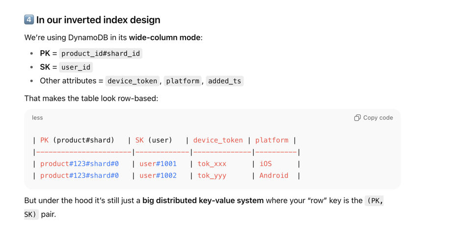

# Question
**Scenario:**

"Our e-commerce startup is introducing a new, highly anticipated feature: **'Flash Sales'**. These are high-demand, limited-inventory sales that last for a very short period (e.g., one hour).

We need to build the backend system that can notify users the *instant* a product on their personal **wishlist** goes on a flash sale.

**Here are the constraints and scale to consider:**

- **Total Users:** 10 million
- **Wishlist Items:** Hundreds of millions of entries (user_id, product_id).
- **Flash Sale Event:** A single popular product (e.g., a new smartphone) might be on **500,000 users' wishlists**.
- **Notification Requirement:** When the flash sale starts, we must trigger notifications to all 500,000 relevant users as close to simultaneously as possible. The goal is to have all notifications *sent* from our system within 2 minutes.
- **Notification Channels:** For now, let's focus on **mobile push notifications**, but the system should be extensible to support SMS and email later.

**Your Task:**

You have **25 minutes** to design the high-level architecture for this **Flash Sale Notification System**.

I want you to focus on:

1. The key services/components and their responsibilities.
2. The data flow from the moment a sale is triggered to when a notification is sent.
3. Your choice of technologies (e.g., databases, message queues) and the justification for them.
4. How you will address the key challenges: **scalability (the 500k user burst), reliability (what if things fail?), and extensibility.**"


# Solution

## High level flow
 - We need a data storage from which we will fetch userIds which has the product going on sale wishlisted
 - we can have a service which chunks the user list and send it to kafka topics for parallel processing. We can have multiple partitions for the notification topic to send notification in parallel
 - the consumers will consume the events in parallel and for each userID they will fetch info req to send notification from notification db(source of truth) or redis cache(reduce latency). The info can be emailID to send emails, device tokens to send push notifications etc
 - then the consumers send req to APN/FCM  inorder to send push notification or email servers to send emails, or for messages we can integrate with services like Twillo.

## Data storage
- the main bottleneck is to fetch the userIDs swiftly given the scale. 
- We cant store userID-> list of product IDs, as we need users per product. So need to store a reverse mapping.
- We can have around 500K users for one single product, so keeping a in-memory productID->list of userID is very expensive.
- Also, if user removes the product from wishlist, updating the list of users stored against product_ID in redis is O(N). So updates are costly
- Here we can leverage inverted index structure to store reverse mapping of productID->userID.
- Using a DB like dynamoDB, we can define productID as partition Key (PK) and userID as Sort Key (SK). And query for the productID and get all the userIDs.
- Also as we are storing each userID per row, we can use a combination of PK,SK to perform O(1) deletion.

### What if a product is hot
- we have a scale where one product can be into 500k users wishlist, in this case the partition of DB can become large.
- we tackle this we cna shard the partition and keep productID+shardID as the PK. Using this PK we can run parallel queries per shard to optimize the userID fetch call made by the service
- we make parallel queries and send them to separate kafka partitions for parallel processing. This helps us to achieve the desired through put

```declarative
Entries in wishlist table of DynamoDB, stored in a column-wide fashion

Item 1 — shard 0
PK  = "product#12345#shard#0"
SK  = "user#10001"
attrs:
device_token: "tok_abc_10001"
platform: "android"
added_ts: "2025-06-01T10:00:00Z"

Item 2 — shard 0
PK  = "product#12345#shard#0"
SK  = "user#10002"
attrs:
device_token: "tok_abc_10002"
platform: "ios"
added_ts: "2025-07-11T12:30:00Z"
```



### Why DynamoDB and what can be the alternatives
- DynamoDB is fully managed. It removes the ops overhead: no cluster sizing, replication, or rebalancing.
- Auto-scaling
- we leverage the combination of PK and SK to create an inverted index like wishlist table, which gave us O(1) updates and O(#users per shard)*#shards searches.
- Single-digit millisecond reads/writes for well-designed PK/SK access patterns.

#### Alternatives which work
**Cassandra**

Pros: Cassandra is a great wide-column store, very good at write-heavy workloads and predictable linear scaling.

Cons: You must run and manage the cluster (replication, repair, tuning compaction). High operational overhead.

DynamoDB gives you the same wide-column model as-a-service. If we were infra-heavy (big SRE team), Cassandra could work; as a startup, DynamoDB is better.

**Elastic search**

Pros: 
faster search as its basically build on an inverted index. Search is faster than dynamoDB.

this is how we can store data in ES. On querying a productID, ES quickly searches its index to fetch the userID lists.E S creates inverted indexes for each searchable field in doc, we can use userID and productID for our usecase
```declarative
{
    "user_id": 4242,
    "product_id": 12345,
    "device_token": "tok_abc",
    "platform": "ios",
    "added_ts": "2025-09-17T10:00:00Z"
}

{
    "user_id": 4243,
    "product_id": 12345,
    "device_token": "tok_abc",
    "platform": "ios",
    "added_ts": "2025-09-17T10:00:00Z"
}
```
Cons:
- very update/delete is costly, as ES rebuilds the index on every update/delete.


**Mongo**

MongoDB’s document model is less natural here: we’d end up with product documents containing giant arrays of users. That leads to huge document rewrites and document size limits (16 MB).

We can create per user wise documents similar to what we did in dynamo.

Use MongoDB sharding with shard key = (product_id, shard_id) → distributes hot products across multiple shards.
Query using shard Key to run parallel queries just like we did in dynamoDB
Mongo also requires more ops work unless you use Atlas.

### WHY NOT?
**Redis**
- cant store this much data in-memory, its expensive

**Document DB**
- gives mongo like functionality, but cant auto-shard like mongo. We can have read replication to handle reads at scale.
- writes go through single writer node, so bottle-neck for writes


