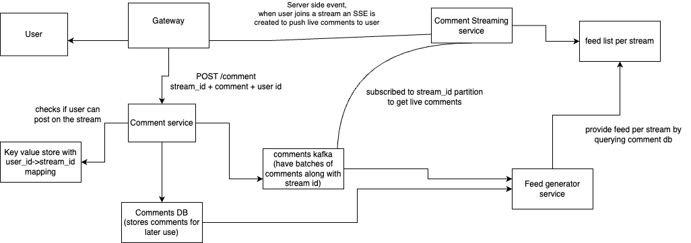

# Question
design a live comment system, consider we have streams going on our system and users can join streams  and see live comments and post there comments too


## Functional Req
- user can post comments
- comments need to be text or images are supported
- user need to see other comments on the stream
- user can reply to comments
- user can join/leave stream, we need to show comments feed to new user


## Non function req
- scalability : Must handle 1M streams, 50M viewers, and 650K comments/min.
- eventual consistency(showing all comments at exact order and time is not req)
- availability, we don't want users getting dropped from streams. Users shouldn’t get disconnected or miss stream updates due to partial failures.


## Core components
- Gateway which routes req to appropriate services
- Comment stream service - responsible to show live comments to user, it establish an SSE(server side event) connection to users who joined the stream, so that user cna get live comments fromm server without polling. To post a commnet user will use the REST endpoint served by comment service
- comment service - responsible to register comments incoming from user
- comment DB - stores comments db which can be later used to show all comments when the stream has ended
- feed generation service - this takes batches of comments and add them to feed list of current ongoing streams
- feed list per stream

### HLD


### comment service
 - user post a comment API payload will look like this
```
{
   "user_id": "u123",
   "stream_id": "s456",
   "comment": "That was an amazing move!"
}
```
- this request comes on the comment service, The comment service can validate if user is part of stream or not by checking a key value store of userid -> stream list(list of streams joined by user)
- this list is created and maintained by streaming service when user joins a new stream

- once validation is done we can batch comments to process for feed and writing to db
- we can use kafka where partition is done by stream_id to store comments and to be consumed by dbWriter workers and feed generation workers
```
{
  "comment_id": "c789",
  "user_id": "u123",
  "stream_id": "s456",
  "comment": "Amazing!",
  "timestamp": 1717171717
}
```

### live comment streaming service
- we maintain an SSE connection with user that have joined a stream
- we keep this service separate as we need to scale this separately then comment service, as writes to comment service compared to reads on the comments by users joined the streams are less
- these servers can subscribe to the kafka based on which steams SSE they have
- so basically if a user comes and joins stream A and the server is not subscribe to that partition, it subscribes so that it can push live comments.
- we will use consistent hashing by user_id to select the live comment server to connect to so we have a spread of users across nodes
- if we hash by stream_id and that stream becomes hot, users joining that stream will land on the same server and overload it.

### feed generation service
- when a new user joins we need to show it initial feed, say last 100 comments on initial load, rest comments we can load lazily
- brute force approach is to query the db for last 50 comments from the current timestamp. This is really slow
- what we can do is maintain a feed list per stream using feed generation service which precomputes feeds for streams by subscribing to comments kafka
- feed generation service comsumes the comments and add them to the redis feed list with stream id as the key
- we return last n comments from that list without putting load on DB.