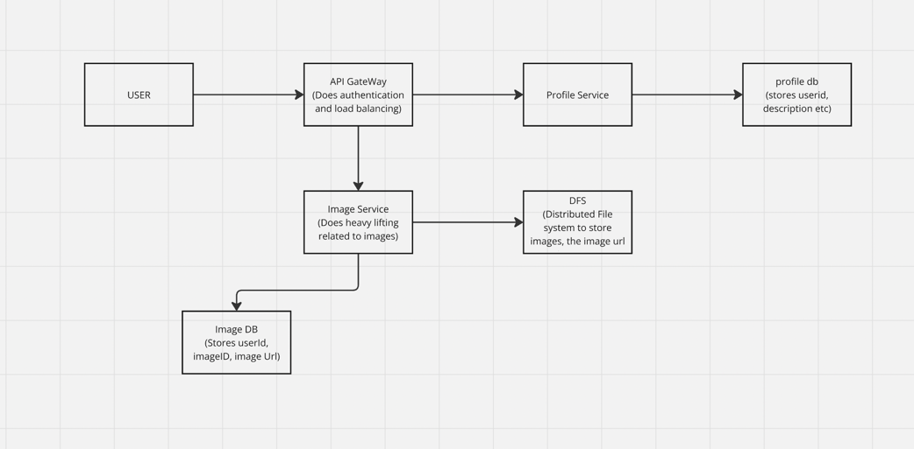
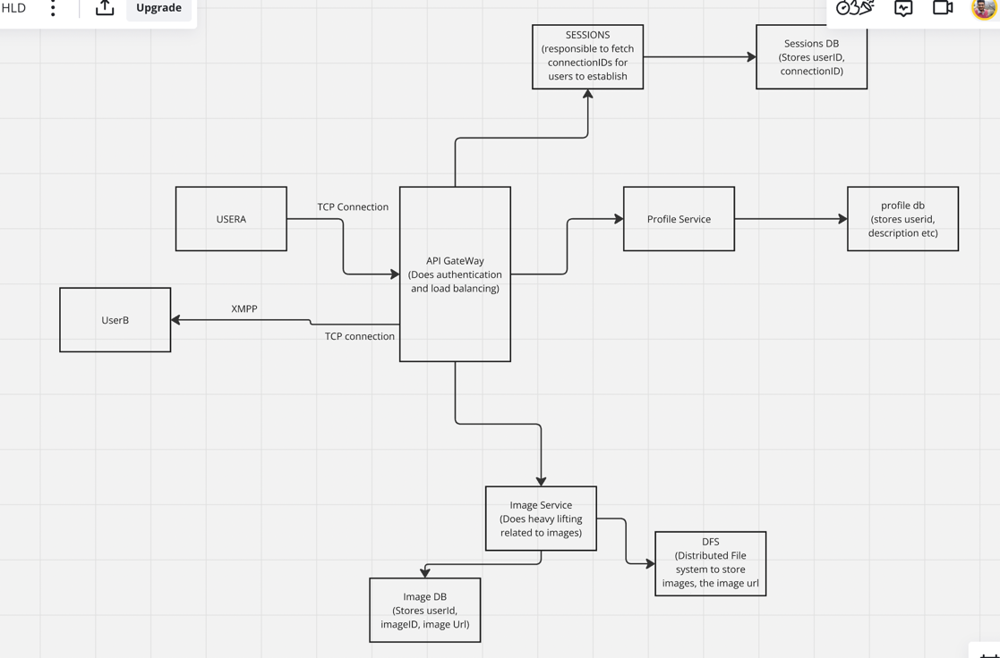
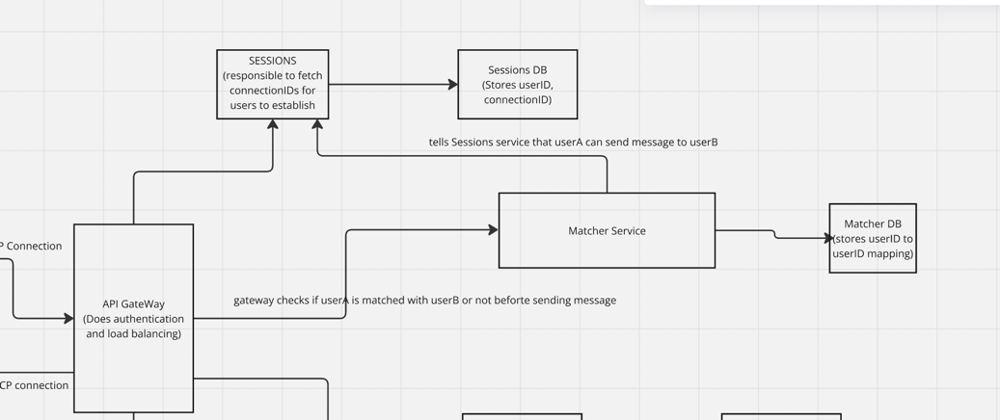
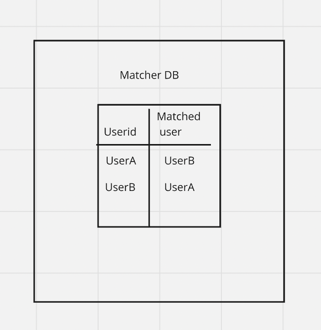
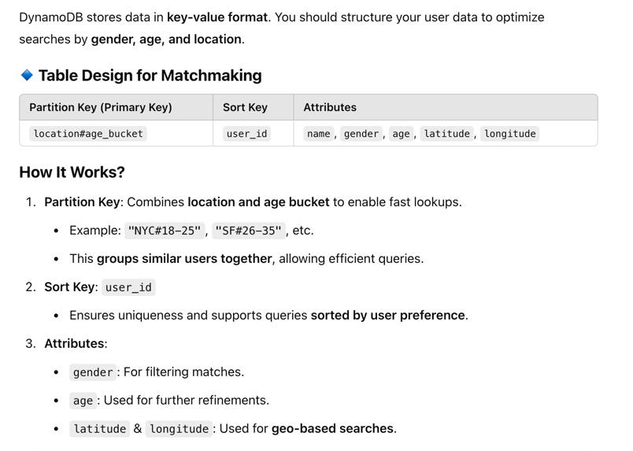
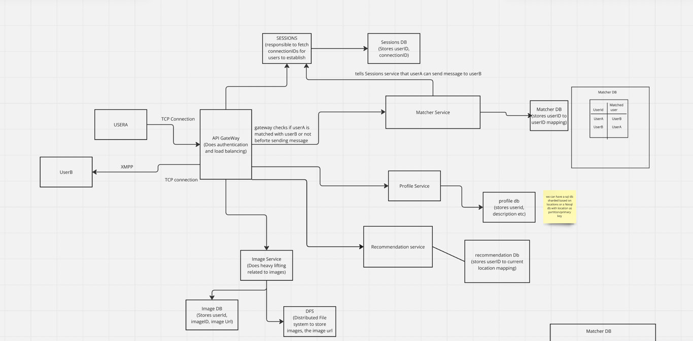

## Functional Requirements
- Store profiles (Images will be their, 5 images per user)
- Recommend matches (No. of active users)
- Note matches (note down matches, for every swipe 0.1% chance of match)
- Direct Messaging 

## HLD of storing profiles

### How to store images?

File vs Blob(Binary large object)
in DBs we can use Blob type to store images.

Let's see what features DB offer and are these useful while storing images
- Mutability: no need to update image, we can create a separate file to store new image
- Transaction properties(ACID): no atomic ops to be on images
- Indexes: we won't be searching on image data
- Access Control: we can get same access control mechanism in a File Sytem

**Why to use File System**
- cheaper
- we can build a CDN over this

We can take a hybrid approach of storing imageID against image URL, and the url points to the location on image on a **Distributed File System**.

## Direct Messaging
XMPP (Extensible Messaging and Presence Protocol) is a real-time communication protocol based on XML. It is widely used for instant messaging, presence detection, and real-time data exchange. XMPP is decentralized, open-standard, and extensible, making it a strong choice for chat applications.

User needs to establish connection to server to send and receive messages. We will introduce a new service for this (SESSIONS service)
it will have a DB of its own that stores userID->connectionID. It will check which connection is the other user using and send a message to that socket so that userB can receive message of userA

we need to have a dedicated xmpp server for real time chats, as API gateway are not suitable to maintain real time connections. The API gateway authenticates and route request to appropriate xmpp server and stores userID -> xmpp server mapping in cache. Client is provided info of xmpp server to create a connection. Now user can directly communicate with xmpp server 

### Better approach
- Use websSockets as they are faster
- Instead of having a sessions service and session DB fetch/store info of which user is connected to which websocket server(CHAT servers will be websocket servers). We will use redis pub/sub
- UserA connects with ServerA. Same for User B. Each user will have a channel created for them in redis which other servers can subscribe to. In this case serverA subscribe to userA channel. This user->channel mapping is stored in redis
- Now when userA sends message to user B, webserverA will fetch the channel id of userB and publish message to it.
- ServerB which is subscribed to channel of userB. gets the message and sends it to userB via the websocket connection.
- Note that redis pub/sub dont store messages so it wont be persisted. Meaning if user is not connected the message will be lost
- If we need to persist messages and deliver when user gets back online. We will use a messaging queue. Publish messsage in queue if not able to send. UserB can poll the queue for any new messages when it is back

### added direct messaging in HLD

## Note matches

Introduce a macther service that provide info of which user matched with which. It persist the data into a DB. Storing a mapping is UserID to UserID.(If A matched with B we will have a record of userA, UserB and UserB, userA)

gateway will first authenticate the message request from matcher service. Then Session service will provide the connection URL to send message 

## Recommendation feature
we need to recommend profiles based on age, gender, location.

We can store all these in profile DB and make a query but that will be slow. We can index all these columns but when we make a query only one of these indexes will be used.(Thats how indexes work) 

**SQL approach:** 

Shard the relational DB based on location so the search is done for nearby shards only. this avoids unnessary searching. Within shards we can have index on age and gender for faster lookups

**Drawback is that it becomes complex**

**NoSql Approach:**

As NoSQL DB like Dynamo is distributed in nature, it already shard the data based on primary key provided. We can provide location as primary key and it will store data relevant to that shard only in it. This gives faster in-build lookups

We will have a recommendations DB that mapps userID to current location. Lets say Current location will get updated per hour. Based on current location we pull up profiles from profile DB relevant to user and provide recommendations.

## Final HLD
