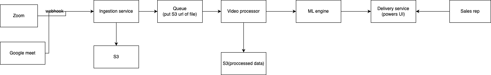

# Question:
Consume video recordings and generate insights for sales team


## Functional req
- Consume and store raw videos from third party (Zoom, teams, meet);
- Process files to get audio and video infos to feed ml moldel
- ML model that takes input and output insights
- Show generated Output to sales reps
- need to do this within 30 minutes of call completion

## Non Functional req
- scalability
- assuming 10K DAU and avg video size of 500MB, if user takes 5 calls a day this gives us a data of 10K * 5 * 500 -> 25,000,000MB -> 25GB of raw data each day
- Security as this is an internal tool


## Basic HLD


### Key components
- ingestion layer
- storage layer
- Processors
- ML engine
- Output layer


### Components deep dive

#### ingestion layer
- We can use webhooks provided by third party(like Zoom) to get notified that video is completed, and ingestion service can fetch
- Alternate way is to poll them to get video data
- The consumption will be done over https for secure transmission. We can use resumable https protocol to get the video
- We can get the entire video and then start the upload on S3. Thi require us to store the video first on disk/additional storage before starting uplaod which is costly in terms of time
  - Instead of 
  
  - Download full file → Save to disk → Upload to S3
  
  - You do:
  
  - For each chunk: Download from Zoom → Stream directly into memory → Upload part to S3 multipart endpoint.


#### storage layer
- S3 for raw files
- nosql db for metadata like, file url, video_id, vendor, timestamp etc
- we can add a cache which stores video_id -> url mapping for faster access. (This can be useful if processor wants to look up for metadata to do processing, if we think metadata is rarely used, we can skip the cache)
- ingestion layer writes to S3, nosql db , cache and then make an entry in the queue to be consumed by processor.
- we can add video_id, url in queue which is going to be picked by processor

#### Processors
- Download chunks of videos in-memory to avoid storage and run processing on them
- we can extract audio file and run audio transcription(can mention AWS transcribe service)
- we can run sentiment analysis, facial analysis using OpenCV or computer vision models to get insights from video
- Aggregate Metadata and store it
- If we don't want to run queries on the data and just want to feed it to the ML model, we can go with S3
- if we want to run queries we can go with nosql db, still will want to store heavy JSON (with transcript, sentiment, embeddings) in S3

#### ML engine
- Processors after aggregating metadata can push video_id and S3 url of metadata in queue to be picked by ml engine workers
- we can scale them horizontally as we need workers to run in parallel for more throughput
- Consume enriched metadata messages (video_id + path to metadata).
- Run ML inference (e.g., classification, embedding, summarization).
- Generate insights (e.g., tags, scores, recommendations).
- Store output (S3 or metadata DB) linked to the same video_id.
- db looks to be a better choice as we may need to query stuff to power our delivery service
- schema for insights could look like this
```
{
  "video_id": "xyz-123",
  "user_id": "rep-456",
  "timestamp": "2025-05-31T12:00:00Z",
  "sentiment": "negative",
  "confidence_score": 0.89,
  "topics": ["pricing", "competition"],
  "summary": "Customer was concerned about cost compared to X.",
  "tags": ["objection", "conflict"],
  "duration_sec": 1840
}
```

#### Delivery service
- Serve API responses to the frontend (React, mobile app, etc.)
- Filter and paginate insights 
- Aggregate metrics for dashboards (e.g., most negative reps this week)
- Support per-user access control (RBAC)
- Ensure fast response times via smart caching
- powered by insights db
- we can add caching to avoid db hits


