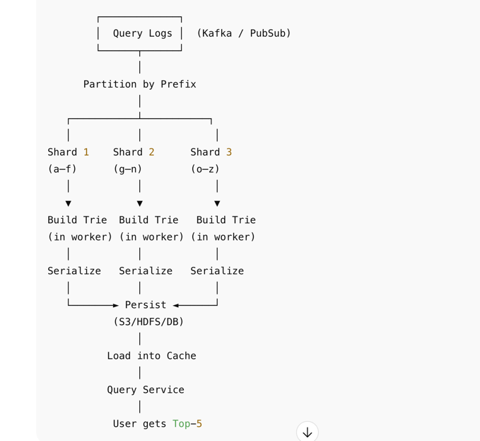

## Prerequisite
You should know what a Trie data structure is. Refer this: https://www.youtube.com/watch?v=AXjmTQ8LEoI

## Functional Requirements
- Relevant suggestion
- sorted result based on popularity/rank

## Non-Functional Requirements
- low response time
- Scalable at level of Google/amazon


## Overview

Basically we can divide the system into two parts. One is **Data gathering Service** that gathers data based on analytics log and create/update the trie DB used to store the data

Other one is our **query service** which returns the relevant suggestions.


## How to store Data

Use Trie Data Structure to store the letter and its rank(freq) in a single node. 
Based on prefix send in query by the user, we will search for that prefix, O(L) where L is len of prefix
then get all the children of that prefix, O(N)
Sort them based on freq and return top k O(klogk)
TC -> O(L) + O(N) + O(klogk)

**See booknotes section for details**

### Optimization
store top k suggestions for each node so that we can return the suggestions in O(1)
TC -> O(L) + O(1)


### How to actually store the data
- We cant keep the trie we build just in in-memory as we need to persist it.
- A key-value pair can be created in-form of prefix->listOf(suggestions) and stored in a key value DB like DynamoDB.
- Also, the KV can be stored in redis for faster retrievals.
- So the Aggregators will build the tri in-memory and, then it will be persisted in cache and DB

## Query Service
User query lands on our APP server, server first check in cache for suggestions then check in DB.

Some additional optimizations for the Query service:

* Using AJAX requests on client-side - these prevent the browser from refreshing the page.
* Data sampling - instead of logging all requests, we can log a sample of them to avoid too many logs.
* Browser caching - since auto-complete suggestions don't change often, we can leverage the browser cache to avoid extra calls to backend.


## Data Gathering Flow
At scale, we never build one global Trie. Instead, we shard queries by prefix/hash, process them in parallel workers (MapReduce/Spark), and each worker builds a local Trie. 

These tries are serialized and persisted independently, then loaded into caches or KV stores. Query service routes lookups to the right shard, achieving O(1) latency. To handle freshness, we support incremental updates for hot prefixes.”




### Data Collection layer
- User queries come in from search boxes.

- Logged asynchronously into a streaming pipeline:

- Kafka / PubSub → HDFS / S3 / GCS (raw logs).

- Each log:
```
{ "query": "google maps", "timestamp": 1693653888 }
```

### Partitioning (Sharding) Queries

- A partitioner assigns each query to a shard based on its prefix.

Sharding strategies:

- First character (a–f, g–n, o–z) → simple but skewed.

- Hash(prefix) → better load balancing.

Example:

- "google" → hash("g") → shard 2

- "amazon" → hash("a") → shard 1

Output: Each shard now has only the queries for its assigned prefix range.

### Distributed Processing (MapReduce / Spark Job)
- Each worker job processes one shard.

- Steps inside each worker:

    - Tokenize queries into prefixes.

    - "google" → "g", "go", "goo", "goog", "googl", "google".

    - Aggregate counts (prefix → frequency).

    - Build a Trie in memory for this shard. 
    - At each node, maintain a min-heap (size K) for top completions.
      Input queries: ["google", "gmail", "github", "gopro", "godaddy"]
```
Trie nodes:
"g"   → top 5: [google, gmail, github, gopro, godaddy]
"go"  → top 5: [google, gopro, godaddy]
"goo" → top 5: [google, goodreads, goodyear, goosebumps]
```

After this we persist the tries into S3/HDFS
A separate service can load the tires into DB and KV and make it available for querying

## How to update suggestions
There are two options to handling updates:

Not updating the trie, but reconstructing it instead. This is acceptable if we don't need real-time suggestions.

Updating individual nodes directly - we prefer to avoid it as it's slow. Updating a single node required updating all parent nodes as well due to the cached suggestions:


## Scaling the storage
As there will be millions of queries, a single tri cant fit all the data.

- We can split the tri(shard it) based on prefix, say a-m goes to T1, m-z in T2

- This info can be kept with a zookeeper. So each time app server needs to query the db(cahce miss), it first checks with zookeeper to find which shard to query from.

- We can always keep multiple copies of sharded DB to increase availability by having a primary-secondary setup. 


## What aggregators do
- Lets say, they aggregate the hourly data coming from analytics log to dialy data. Get the frequency of search terms. And stores them in a no sql db.(schema can be refered in  notes)

- We can add functionalities in aggregators like drop terms with freq less than threshold. To skip irrelevant queries to get process.

- We can configure it to assign weights instead of freq to terms based on some ranking system(could be based on time if we need to suggest recently searched terms)


## What workers do
- Can be scheduled to run say every 30 mins/1 day to update the tri DB
- Each worker can pick a shard to dump the data after processing(shard info can be accessed from zookeeper)


## Further optimizations
- cache data at CDN level for faster queries based on geographies
- provide search terms for popular searched along with the suggested ones and get them cached at browser so that req don't come to server everytime
