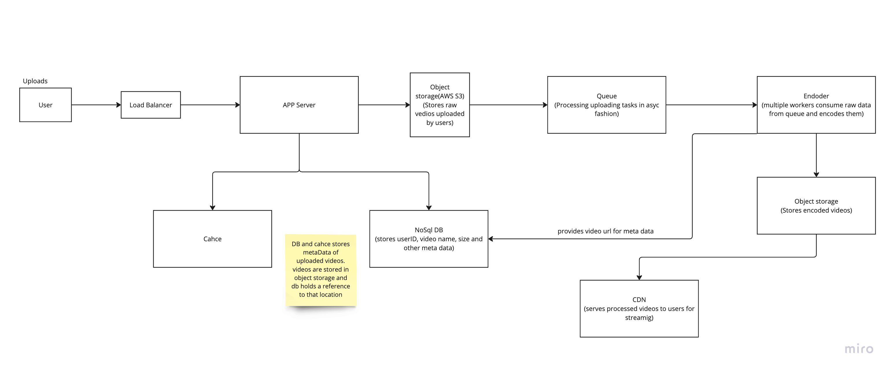

## Functional requirements
- Upload
- Stream

We majorly discussed this, other features can be search, recommendation
## Non Funtional requirements
- Availability
- Low latency
- Scalability

## HLD

## Upload
- Use S3 type storage to stores video data. Rest of metadata goes to noSql db. noSQL scales better as read wil be heavy. And no need to have heavy consistency.
- Encoding of videos are time-consuming so they can be done real time. So we add a message queue to process the raw videos.
- Encoding servers picks the raw videos based on queue and process them and stores them in a separate S3. After processing they update the metatdata in cache and DB. The encoded videos are distributed over CDNs
- Encoding consist of converting videos in different formats(to serve different clients) and resolutions to handle latencies(if user net connection is poor we start serving a lower resolution video)
- **indepth detail of encoders is in booknotes. Avoid discussing in detail as it requires a lot of domain knowledge regarding encoders**

**Question: How many encoders we need?**
- assuming 50mill/day upload traffic
- assuming 1 video takes 1 min to upload on an average
- 50 mill/100,000 = 500/sec (assuming we have 100,000 second in day for rough calculation)
- Work to be done = 500*60sec = 30k workers will be needed

**Question: how does client uploads the file

- We avoid writing big files on the App Server entirely: instead, the App Server issues a pre-signed URL so the client uploads directly to S3
- this leverage the S3 native Multipart upload API, which supports resumable uploads.
- it allows user to upload the file in chunks

## Stream
- The user requests a video via post req
- app server checks if user is authorized to see the content doing basic validations
- it responds with a pre-signed URL to user
- the browser/player uses the url to stream the video
- the req goes to CDN first and chunks of video are served via DASH protocol.In real world app, videos are served in chunks to reduce latency. **YouTube uses DASH (Dynamic Adaptive Streaming over HTTP)**, which breaks videos into small chunks (~2-10 seconds each)
- if CDN does not have the video cached, req goes to S3 and the file is then cached at CDN and served to user.
- Videos are cached at CDN to reduces latency and are served from there
- Video stored as chunks helps to control resolution in case user have poor connection(we can start serving rest of the chunks in lower resolution to reduce buffering)

**Question: What protocol should be used for streaming?**

In On demand streaming(YouTube, netflix, prime)
- Reliability is more important than speed(You don't want frames getting dropped while watching a movie and missing the plot twist. Huh!!). So we use TCP
- YouTube/Netflix use DASH (Dynamic Adaptive Streaming over HTTP), which works on top of TCP.
- Content Delivery Networks (CDNs) Use HTTP/HTTPS, Which Runs on TCP
 