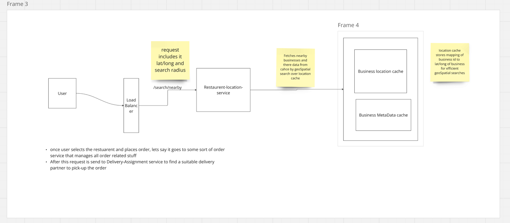

## Core problem

### how to provide real time locations to users of nearby friends

We will use websockets and  redis pub/sub for this

**REFER tinder direct messaging for details of how they work together**

#### Periodic location updates

- we assume that location refresh happens every 30s
- location message is send to websocket connected to user
- the websocket publish the message to redis channel dedicated for the user
- The websocket servers which have subscribed to the user channel receives the updated location, calculates if it is within the threshold(nearby say 5Km) and sends the location update to the friend

#### User opens the app
- connection to a websocket server is established.
- server fetches the friends list from user db
- the socket then subscribes to the friends channels to get location updates.
- initially, webserver gets friends latest location from location cache, and based on this calculates which are nearby and show the data to user.
- Later this data gets updated as websocket is subscribed to the friends redis channel too.

#### usecase if instead of friends we need to fecth random people locations

- we can create geohash based channels and users within those geohash can subscribe to those and get location updates of users in that geohash
- websocket gets lat/long, calculates geohash and subscribe to that channel for updates
- websocket can subscribe to nearby geohash channels too in order to handle cases where user is nearby(within threshold) but in other geoHash

