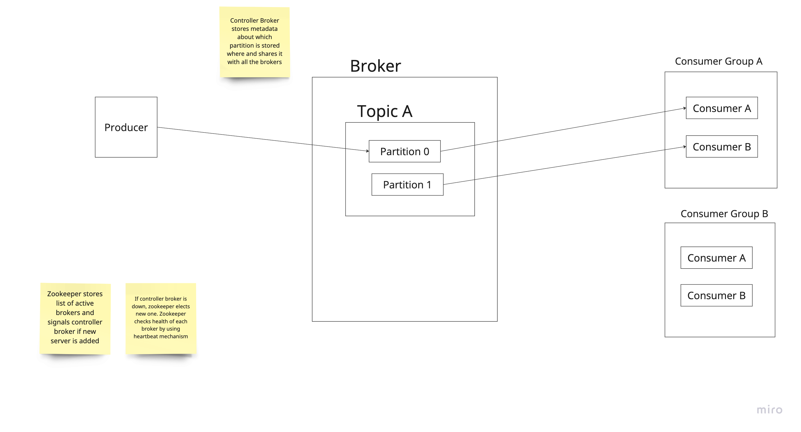

### Function req
- sends message
- receive message

### Non functional req
- scalable
- highly available

### Message types
#### Point-to-Point
- only one consumer consumes the message
- mesage is deleted once its consumed

#### Pub/sub
- multiple consumers can consume the message
- message is stored for a configurable period of time

### HLD

- We have a producer
- Producer talks with broker. Broker is basically a server. (A kafka server is called a Broker)
- Broker can have many Topics. In Kafka terms, a topic is an append only log file which can be read by multiple consumers, and retains these msgs in log forms even after consumption for a configurable amount of time
- A Topic can have many partitions
- Inside a Partition we have Offsets. Offsets tells till where in the partition, consumer has read the message. Offset uniquely identifies a message in a partition
- Consumer reads from Partitions.
- Each consumer is part of one Consumer Group
- Within a consumer group, different partition are read by different consumer. No partition is read by multiple consumers of the same consumer group
- There can be many Brokers. Group of these Brokers is called a Cluster
- Zookeeper helps Brokers to interact with one another. Zookeeper has info of which partition is stored in which Broker(older kafka version store info in zookeeper, modern ones use Controller Broker setup, read in next section for that)
- We can have replicas of partitions stored on different brokers for fault tolerance. The partition can have a Master slave set up. All read and write happens in master. Slave polls for changes. If master fails, slave gets promoted as master.
- In case a consumer goes down, another consumer from same Consumer group takes over the subscription of the partition. Zookeeper knows which consumer has read till which offset so the new consumer can start reading from that offset. Broker connected to consumer group listens to hearbeats of the consumers. based on heartbeat it knows if consumer is down or not. If Consumer is down, broker triggers rebalancing of partition
- retry mechanism can be placed in case a message is not being processed.(could be a buggy message). Once retry threshold is reached. We move the msg to another queue.(Dead letter Queue)

### Message format 
- key: ID (not mandatory)
- Value: Actual msg
- Topic: topic name
- Partition: partition id where msg will go(not mandatory) 
If key is there, we compute hash of it and that give partition ID.

If key is not there, we can also define a particular partition it should go.

If both not there we can set up a round-robin policy

### What is controller broker and whats its role

- Brokers also follow a master slave acrh
- Controller Broker is the master broker
- When new broker instance is added, Zookeeper adds it to active brokers list
- Zookeeper then send info to Controller Broker, that new Broker is added. Partitions are rebalanced by Controller broker among the exisiting and new broker.
- Controller broker creates metadata regarding info of which partition lies where. And send to each broker.
- So each broker has data regarding which partition is stored where
- Producer queries any available broker and gets info on which broker to send message for a particular partition. Master partition receives the message, and slave replicas sync the new message on them.

### Data storage
Refer Data storage section of notes. Important to discuss how data is stored so give it a read.

