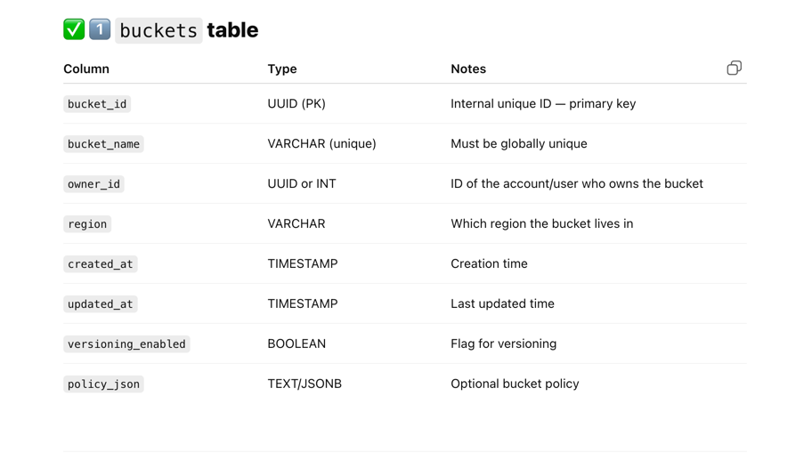
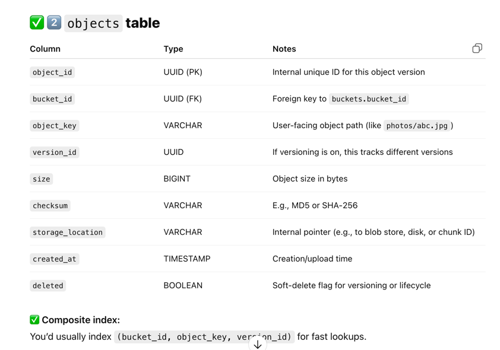
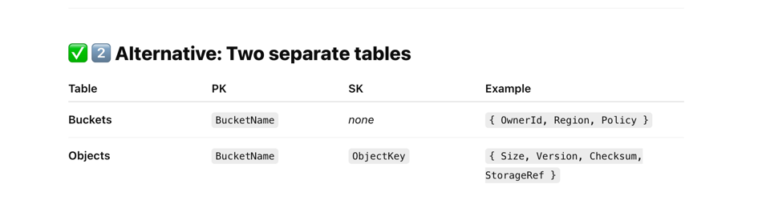

Refer this, its better written.
http://codesmith.io/blog/diagramming-system-design-s3-storage-system

### Core services 
- data service(stores object and returns object Id) 
- metaDataService(stores metaData info of the object stored)

### Data Model
For metaData DB
- Bucket table(has bucket id)
- Object table(has object Id, object name, bucketId as foreign key)

#### Which DB to use
SQL
 - can maintain relationships between object and buckets
 - at scale we will need to shard effectively
 - we can shard the objects table based on bucket_ID
 - incase shard is hot, we need to further partition the shard to handle load
 - we can have conditional writes to make sure bucket_name is unique

NoSQL
 - we can have buckets and objects table
 - bucket_name can be used as partition key
 - this means all objects for one bucket cna be found in one shard. Easy to support list all objects under table feature
 - better read/write at scale
 - conditional writes supported, so unique bucket_name can be ensured
 - if a shard is hot, we need to sub partition it. Can be done by created partitions under a shard based on say hash(objectKey)%N, where N is number of partitions needed

Both can achieve the desired results if designed right. NOSQL give out of the box distributed scaling so we can go with it as te scale is to store PBs of data.If scale is in 100TBs and we feel need on running complex queries and strong consistency we can use SQL

#### To create a bucket

- The client sends an HTTP PUT request to create a bucket.
- The client’s request reaches the API service, which calls identity and access management (IAM) for authentication and authorization.
- A bucket, as we mentioned, is merely metadata. On successful auth, the API service calls the metadata service to insert a row in a dedicated buckets table in the metadata database.
- The API service returns a success message to the client.

#### To upload an object

- With the bucket created, the client sends an HTTP PUT request to store an object in the bucket.
- Again, the API service calls IAM to perform authentication and authorization. We must check if the user has write permission on the bucket.
- After auth, the API service forwards the client’s payload to the data service, which persists the payload as an object and returns its id to the API service.
- The API service next calls the metadata service to insert a new row in a dedicated objects table in the metadata database. This row holds the object id, its name, and its bucket_id, among other details.
- The API service returns a success message to the client.

#### To download an object

- With the bucket created and the object uploaded, the client sends an HTTP GET request, specifying a name, to retrieve the object.

- The API service calls IAM to perform authentication and authorization. We must check that the client has read access to the bucket.

- Since the client typically sends in the object name (not its id), the API service must first map the object name to its id before it can retrieve the object. Hence, on successful auth, the API service calls the metadata service to query the objects table to locate the object id from its name. Note how, in the download flow, we visit the metadata service before the data service, as opposed to the upload flow.

- Having found the object id, the API service sends it to the data service, which responds with the object’s data.

- Finally, the API service returns the requested object to the client.

#### How is data exactly stored and managed
- Data is actually stored on disks(HDD/SSD)
- internally data service will have storage nodes running which interact with disks.
- We will have replication in place for the storage nodes to ensure high availability.
- In disk, we use blocks to store the data, each block has a size of 4kb. 
- in S3 we store object as a whole so files smaller than 4KB are stored in one block. Files more than that are split into chunks
- This cause space wastage as files smaller than a block size occupy the entire block, but thats how S3 choose to function
- In traditional HDFS, data is written in a Write Ahead log (WAL) fashion, where if space is left in a block. A separate object can be written there. This optimizes space but adds complexity
- In both the cases we need an internal DB to store the locations of the chunks of objects against the unique object ID, which will help us in retrieving the object in case of a GET call
- keeping an internal db makes data service stateful. So we need to know which data service instance to route the GET req
- we can use consistent hashing by hashing the server id and object name so that we route the get req to the data service node which actually have the locations of object name in its internal DB.

#### How Auth works
- authentication can be done based on session_id/JWT token
- authorization needs to be done based on policy of bucjet on which operation is to be done
- policy json is stored in metadata db acts as source of truth and auth service needs to fetch policy from db to check if req is valid or not
- to reduce db hit we can cache bucket->policy mapping in redis
