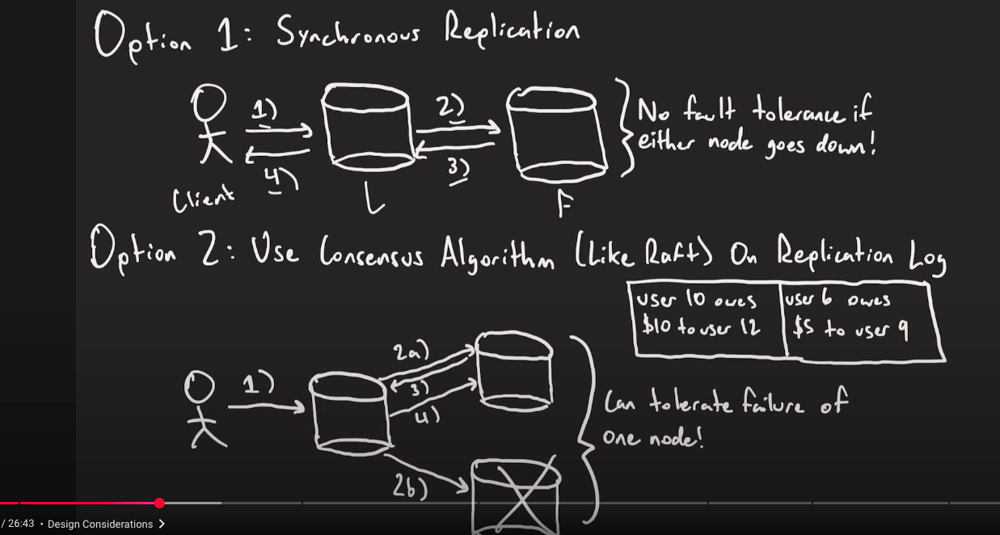

### Core problems

#### Strong Consistency

- we can do Synchronous Replications: Write is not valid until follower DB has not ACK it. Issue is Fault Tolerance. If leader does down, we cant make write. If follower DB goes down, we cant make write as valid ACK from follower is needed inorder for a Write to be valid.
- **Use Consensus Algo**: Write is valid if its written in majority of nodes. Same goes for Read. It give fault tolerance as, as long as the a set of nodes are available decision can be made if the consensus threshold if achieved.(Eg, out of 3 nodes 1 is down, still write cna be made to 2 nodes which is majority)
 
Trade-off:
- inorder to maintain strong consistency. We have to make trade off with latency. As we need to replicate write and reads on multiple nodes. DB ops will take time. But for this system as Consistency is imp we can make this trade off

#### Idempotent payments
- In a payment system, idempotency refers to ensuring that a repeated payment request with the same parameters (e.g., amount, payment method, user) does not result in multiple transactions being processed or charged. This is crucial for preventing duplicate charges, especially in scenarios where a payment gateway or server may receive the same request more than once due to retries (network issues, timeouts, etc.).
- We can pass a unique ID(idempotency key) for each payment request. Same reuqest will have same key. We cna check at our payment service if the key is already stored in DB or not and take a call if transaction attempt is duplicate or not.
- Each unique transaction attempt is stored in payment service DB with the unique ID as the primary key
- We can have the client to generate the unique ID

#### handle failures
1. **Call to PSP fails**
   - What if we mark payment as pending and never sent it to PSP(for eg: payment service died)
   - We need to process pending payments in our DB.
   - We cal poll to PSP with these payments and get the latest status.
   - If PSP has not seen the payment. This indicates a failure at our end. We can delete the record and show user payment failed message.
   - Success, failure, in progress status we can get from PSP and can update accordingly in our DB.

2. **PSP takes time to respond**
   - We wont be getting payment response instantly.
   - We can introduce an API endpoint(webhook) and give it to out PSP to hit it incase they are ready with the response.
3. **How to process pending payments**
   - introduce a pending payment cache
   - we can poll the PSP for every entry in the cache.
   - Update the DB if there is a chance in the pending payments.
   - To create this cache, we can add entry of payment in kafka when we first write in the DB. So we can consume the pending payment events from kakfa and create the cache to poll for the updated status.
   - Can be a case where PSP returns response for pending payment before we poll. In that case when cache gets to know this payment is already processed we can remove that entry.
4. **How to maintain consistency in wallet and ledger services.**
    - We create separate topics of pending and other payments.
    - pending payment topic is subscribed by consumer to build cache.
    - Other payment topic is subscribed by wallet and ledger service.
    - So there DB updated only when transaction is successful or failed(We have solid info that transaction was processed).

### Example Workflow:

1. **User Submits Payment:**
    - The user initiates a payment request, and your service generates a unique idempotency key (e.g., `UUID12345`). Key can be created at payament page load time and stored in browser. This is now send to payemnt service 

2. **Check Database:**
    - Your payment service queries the database to check if the `UUID12345` idempotency key already exists.
        - **If Found:** It means this payment has already been processed, and the service retrieves and returns the status (e.g., success or failure) from the original transaction.
        - **If Not Found:** The service proceeds to step 3.

3. **Send Payment to PSP:**
    - An entry is made with the key in payment service DB with transaction status as pending.
    - Your service sends the payment request to the PSP with the `idempotency_key`.
    - The PSP processes the payment and returns a response (success or failure).

4. **Update Database:**
    - Once the payment is processed, your service records the result in the database with the `idempotency_key` and other transaction details (such as `transaction_status`, `user_id`, `amount`, etc.).

5. **Update Other Services (Wallet & Ledger):**
    - After the payment is successful, your service updates the **Wallet Service** (e.g., credit the user's account) and **Ledger Service** (e.g., record the transaction in the ledger).

6. **Return Response to Client:**
    - Your payment service returns the response (success or failure) to the client, based on the stored result.
