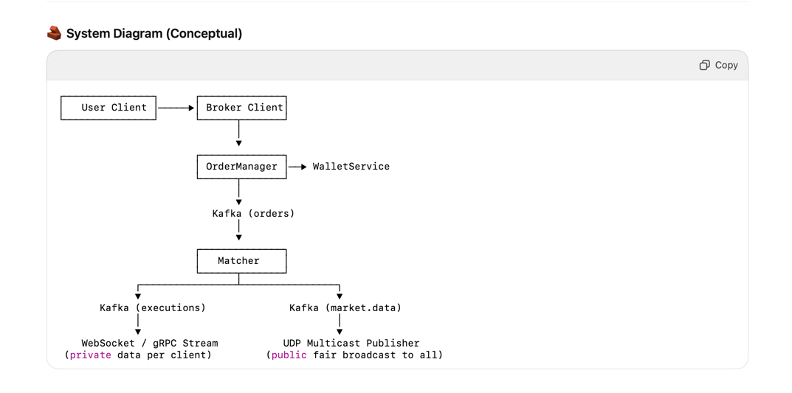

🏦 Stock Exchange System — Design Notes

## Functional Requirements
- Users can place, cancel, and modify orders.
- Users can view market data (trades, order book, best bid/ask).
- Users can view their own order/execution logs.
- The system must validate wallet/balance before accepting new orders.

## Non Functional Requirement

- Low latency : Sub-millisecond order matching & dissemination
- High availability: Fault-tolerant, recoverable matcher
- Fairness: All clients receive identical market data simultaneously

## high level flow
User → Broker Client → Order Manager → Kafka → Matcher → Kafka → Market Data Publisher → Clients

### Detailed Component Responsibilities

1️⃣ Broker Client
- User-facing service (Web, mobile, API gateway).
- Authenticates user and manages session.
- Forwards requests to the Order Manager.
- Streams live market data & order updates via WebSocket.

2️⃣ Order Manager

Responsibilities:
- Receive new order / cancel / replace requests.
- Validate:
- User authentication.
- Wallet / balance (via Wallet Service).
- Rate limits, risk checks (e.g., position limits).
- Assign a unique clientOrderId.
- Partition orders by symbol and produce them into Kafka.
```
ProducerRecord<String, OrderEvent> rec =
new ProducerRecord<>("orders", symbol, event);
producer.send(rec); // key = symbol → ensures order per partition
```

3️⃣ Kafka — Sequencer & Persistence Layer
- Single partition per symbol (or shard) gives total order of events.
- Durable log ensures crash recovery of the matcher.
- Acts as the source of truth for sequencing, replay, and persistence.

Benefits:
- Deterministic ordering per symbol.
- Append-only immutable log.
- Used to rebuild in-memory state on restart.

4️⃣ Matcher Service (Matching Engine)

The heart of the system — matches buy/sell orders in real-time.

🧠 Data Structure
```
NavigableMap<Long, LinkedList<Order>> bids =
    new TreeMap<>(Comparator.reverseOrder());
NavigableMap<Long, LinkedList<Order>> asks =
    new TreeMap<>();
```

- Key: Price (in ticks)
- Value: FIFO LinkedList of orders at that price
- Auxiliary Index: Map<OrderId, Node> for O(1) cancel/replace.

✅ Buy Book: sorted descending by price
✅ Sell Book: sorted ascending by price
Example
```
BUY:
100 → [B1, B2]
 99 → [B3]
 98 → [B4]

SELL:
101 → [S1]
102 → [S2, S3]
```

💥 Matching Logic

When a new order arrives:
- BUY matches against best SELL (price ≤ buy price).
- SELL matches against best BUY (price ≥ sell price).
- Fills generate Trade Events.

🧱 Persistence & Recovery
- The matcher consumes orders from Kafka.
- On crash:
  * Load the last snapshot (book state). 
  * Replay Kafka events from the last processed offset. 
  * Deterministically rebuild in-memory book.

Thus Kafka acts as a write-ahead log (WAL) for the matcher.

5️⃣ Kafka — Post-Trade Bus

Matcher produces to another Kafka topic after processing:
Topic
executions: Private order fills & execution reports
market.data : Public trades & order book deltas

Kafka ensures durability and consistent event ordering across downstream systems (clearing, reporting, market data).

6️⃣ Market Data Publisher (MDP)

Subscribes to the market.data topic and disseminates updates to all clients.

🛰️ Public Data (Trades, Quotes)
- Protocol: UDP multicast
- Goal: All clients receive the same packet at the same time
- Fan-out handled by network switches via multicast groups.
 🧩 Fairness guarantee:
- One multicast packet → replicated in hardware → all clients receive simultaneously.
- Sequence numbers + replay channel handle UDP loss.

🔒 Private Data (Order Logs, Wallet)
- Protocol: WebSocket / gRPC stream.
- Each client receives their own execution reports from the executions topic.
- Supports live order status, fills, cancels.

7️⃣ Wallet Service
•	Before routing an order, Order Manager calls Wallet Service:
•	Validate available balance.
•	Lock funds during order placement.
•	Release or adjust after fills.

Example flow:
OrderManager → WalletService.reserveFunds(userId, requiredMargin)

⚡ Example End-to-End Flow
1.	User places BUY order 100 AAPL @ $99.
2.	Broker Client sends to Order Manager.
3.	Order Manager validates wallet → sends to Kafka (key=symbol).
4.	Kafka routes to AAPL partition → Matcher consumes sequentially.
5.	Matcher updates book, matches orders → emits:
•	Execution reports to executions
•	Market data deltas to market.data
6.	Market Data Publisher multicasts updates over UDP.
7.	Clients receive:
•	Public updates (market data)
•	Private WebSocket notifications (fills/cancels)


